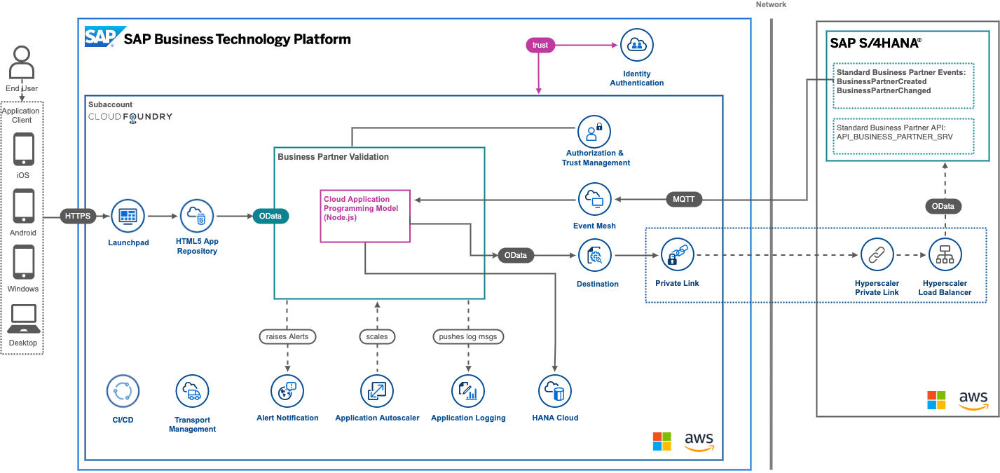

# Enhance core ERP business processes with resilient applications on SAP BTP - SAP Private Link service

## Business Scenario

In this use case we are going to use the SAP Private Link service to communicate with an SAP S/4HANA system (or other SAP or non-SAP system running on a VM in your own Azure account) privately from within the SAP BTP, Cloud Foundry Runtime without SAP Cloud Connector.

Using the SAP Private Link service will not require the SAP Cloud Connector anymore to expose the systems and communication through the internet, the entire traffic is secured by internal hyperscaler network without any exposure.

The current use case is describing an SAP S/4HANA extension application, of course having an SAP S/4HANA solution deployed on Azure infrastructure.
  
 >Note: Currently, we only support the connection from SAP BTP Cloud Foundry to Azure Private Link services. 

The business scenario in a nutshell:

John who is an employee of Business Partner Validation Firm iCredible, which is a third-party vendor of ACME Corporation would like to get notifications whenever  Business Partners are created/updated in the SAP S/4HANA backend system of ACME Corporation. John would then be able to review the Business Partner details in his extension app on the SAP Business Technology Platform. He would proceed to visit the Business Partner’s registered office and do some background verification. John would then proceed to update/validate the verification details into the extension app. Once the details are verified, the Business Partner gets activated in the SAP S/4HANA system of ACME Corporation. 

This means:

- You will deploy a custom extension application on SAP Business Technology Platform that works independently from the SAP S/4HANA system

- Changes in the SAP S/4HANA system are communicated via events in real time to the extension application

- The Vendor personnel only needs access to the extension application and not to SAP S/4HANA

### Solution Diagram

The Business Partner Validation application is developed using the SAP Cloud Application programming Model (CAP) and runs on the SAP BTP, Cloud Foundry runtime. It leverages platform services like SAP Event Mesh, SAP HANA Cloud and the SAP Private Link service. Whenever a change in the SAP S/4HANA on-premise system occurs, an event on SAP Event Mesh is triggered. The CAP application on SAP BTP will asynchronously consume the event and process the payload. This means, some additional data is read using OData APIs from the SAP S/4HANA on-premise backend and stored in SAP HANA Cloud on SAP BTP to be independent from the actual SAP S/4HANA system.

## Requirements
The required systems and components are:

- SAP S/4HANA on premise system.
- SAP BTP account

Entitlements/Quota required in your SAP Business Technology Platform Account:

| Service                            | Plan        | Number of instances |
| ---------------------------------- | ----------- | ------------------- |
| Connectivity                       | lite        | 1                   |
| Destination                        | lite        | 1                   |
| HTML5 Application Repository       | app-host    | 1                   |
| Event Mesh                         | default     | 1                   |
| Application Logging                | lite        | 1                   |
| Authorization & Trust Management   | application | 1                   |
| SAP HANA Schemas & HDI Containers  | hdi-shared  | 1                   |
| SAP HANA Cloud                     |             |                     |
| Cloud Foundry runtime              |             |                     |
| Application Autoscaler             | standard    | 1                   |
| SAP Private Link                   | standard    | 1                   |

Subscriptions required in your SAP Business Technology Platform Account:

| Subscription                      | Plan             |
| --------------------------------- | ---------------- |
| SAP Business Application Studio   | standard         |
| Event Mesh                        | standard         |
| Launchpad Service                 | standard         |
| Continuous Integration & Delivery | default          |
| Cloud Transport Management        | saas-application |

## Setup & Configuration

- Step 1: [Identify APIs in API Business Hub](./tutorials/01-IdentifyAPIFromAPIBusinessHub.md)
- Step 2: [S/4HANA Enable OData Service for business partner](./tutorials/02-configure-oData-Service)
- Step 3: [Setup SAP BTP Enterprise Environment](./tutorials/03-PrepareBTP)
- Step 4: [Create SAP HANA Cloud instance](./tutorials/04-SetupHANACloud)
- Step 5: [Setup connectivity between S/4HANA system, SAP BTP - SAP Private Link](./tutorials/05-PrivateLink)
- Step 6: [Configure Business Application Studio and Build/Deploy the CAP application ](./tutorials/06-ConfigureCAPApp)
- Step 7: [Configure Event Based Communication between S/4HANA and Event Mesh](./tutorials/07-SetupEventMesh)
- Step 8: [Test scenario End to End](./tutorials/08-TestApplication)

## How to obtain support

[Create an issue](https://github.com/SAP-samples/<repository-name>/issues) in this repository if you find a bug or have questions about the content.
 
For additional support, [ask a question in SAP Community](https://answers.sap.com/questions/ask.html).

## Contributing

If you wish to contribute code, offer fixes or improvements, please send a pull request. Due to legal reasons, contributors will be asked to accept a DCO when they create the first pull request to this project. This happens in an automated fashion during the submission process. SAP uses the standard DCO text of the Linux Foundation.

## License
Copyright (c) 2021 SAP SE or an SAP affiliate company. All rights reserved. This project is licensed under the Apache Software License, version 2.0 except as noted otherwise in the [LICENSE](LICENSES/Apache-2.0.txt) file.
